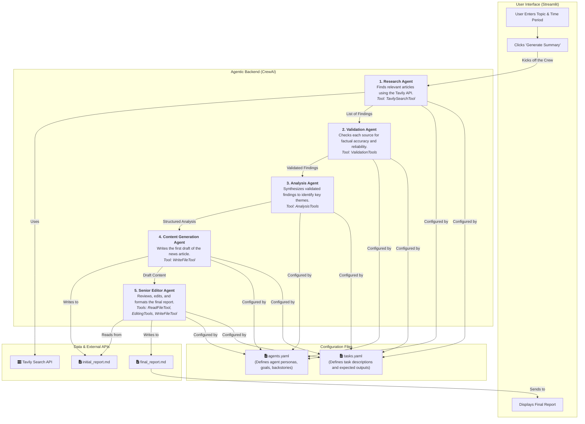

# Agentic News System Architecture

This document breaks down the architecture and workflow of the Agentic News Summarization system.

## System Architecture and Workflow

This diagram shows the two main parts of the system: the **User Interface** and the **Agentic Backend**. The workflow proceeds sequentially from the user's input, through each specialized agent, until the final report is generated and displayed.

## How to Explain This to Your Team

1.  **Start with the User:** The process begins in the Streamlit UI, where a user enters a topic.
2.  **The Crew Kicks Off:** This triggers our `NewsSummarizationCrew`. The crew is configured using two YAML files: `agents.yaml` for defining *who the agents are* (their personalities and goals) and `tasks.yaml` for *what they do* (their specific instructions).
3.  **The Research Agent:** The first agent takes the topic and uses the **Tavily API** to find recent, relevant articles. It passes a list of its findings to the next agent.
4.  **The Validation Agent:** This agent acts as a fact-checker. It reviews the sources from the researcher and assigns a confidence score, filtering out unreliable information.
5.  **The Analysis Agent:** This agent looks for the "so what." It takes the validated facts and synthesizes them, identifying the key themes and narratives.
6.  **The Content Generation Agent:** Using the analysis, this agent writes the first draft of the news report and saves it as `initial_report.md`.
7.  **The Senior Editor Agent:** The final agent reads the draft, edits it for style, grammar, and clarity, and then writes the polished `final_report.md`.
8.  **Display the Report:** The system serves this final markdown file back to the Streamlit UI for the user to read.

This entire process ensures a "chain of evidence," where the final report is built upon layers of validated and analyzed information, reducing the risk of errors and hallucinations. 